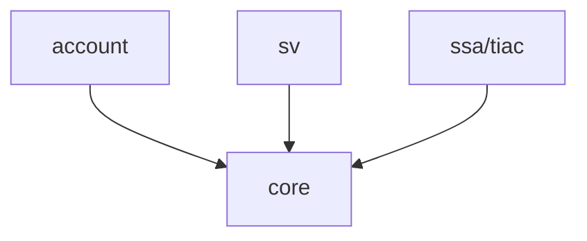

# Sèves – Architecture technique

## Vue d'ensemble

Sèves est une application de **gestion mutualisée des événements sanitaires** pour le ministère de l'Agriculture, couvrant trois domaines métier : Santé des Végétaux (SV), produits alimentaires (SSA) et toxi-infections alimentaires collectives (TIAC).

C'est un **monolithe modulaire** Django/PostgreSQL : une seule base de code et une seule base de données, mais une logique isolée par domaine dans des apps Django dédiées.

| App        | Rôle                                                                          |
|------------|-------------------------------------------------------------------------------|
| `core`     | Transversal : documents, structures/contacts, notifications, antivirus, audit |
| `account`  | Comptes et permissions                                                        |
| `sv`       | Santé des Végétaux                                                            |
| `ssa/tiac` | Produits & cas alimentaires (rappels, non-conformités) & Toxi-infections alimentaires collectives                     |

Chaque domaine (`sv`, `ssa`/`tiac`) est protégé par un groupe Django dédié, a son propre point d'entrée et sa documentation utilisateur externe. Les apps métier ne dépendent jamais les unes des autres : elles ne partagent que `core`.

Les opérations lentes ou dépendant d'appels externes (antivirus, génération de documents, SFTP) sont déclenchées depuis le web mais exécutées de façon asynchrone via **Celery**, avec **Redis** comme broker. **`django-waffle`** permet d'activer/désactiver des fonctionnalités indépendamment d'un déploiement.

Côté front : **DSFR** (`django-dsfr`) pour les gabarits et composants, contrôleurs **Stimulus** chargés en modules ESM via *importmap*, lint/format assuré par **Biome**.

## Authentification et autorisation

L'authentification est entièrement déléguée à **Agricoll** (OIDC du ministère de l'Agriculture). Un compte doit préexister, provisionné par l'import des contacts Agricoll, et les nouveaux comptes sont inactifs par défaut (`USERS_NOT_ACTIVE_BY_DEFAULT = True`) : ils doivent être explicitement activés et affectés à un groupe.

L'autorisation repose sur des groupes Django (`sv_user`, `ssa_user`), vérifiés à chaque requête par `seves.middlewares.LoginAndGroupRequiredMiddleware` : authentification obligatoire hors login/callback OIDC, et appartenance au groupe correspondant au domaine métier visité.

## Infrastructure et déploiement

L'application est hébergée sur **Scalingo** (région `osc-secnum-fr1`) avec quatre services :
* `web` : nombre variable de containers Gunicorn/Django
* `worker` : un container exécutant `celery -A seves worker`
* `db` : instance PostgreSQL managée
* `redis` : broker de messages Celery

### Services externes

| Service                                                                                                                                                                                     | Usage |
|---------------------------------------------------------------------------------------------------------------------------------------------------------------------------------------------|---|
| Agricoll (OIDC)                                                                                                                                                                             | Authentification des agents publics |
| Import SFTP Agricoll                                                                                                                                                                        | Annuaire agents/structures → table des contacts, utilisée pour l'attribution des comptes et le routage des notifications |
| S3                                                                                                                                                                                          | Stockage des documents/pièces jointes (`django-storages`) |
| Antivirus (API tierce)                                                                                                                                                                      | Analyse de chaque document uploadé avant mise à disposition au téléchargement |
| Sentry                                                                                                                                                                                      | Centralisation des erreurs applicatives (web + worker|
| Webhook Maestro                                                                                                                                                                             | Notification externe à la création/modification d'un événement produit (SSA) |
| APIs open data : `geo.api.gouv.fr`, `api.insee.fr` (SIRENE), `data.economie.gouv.fr`, `fichiers-publics.agriculture.gouv.fr`, `data.geopf.fr` (Géoportail IGN), `openmaptiles.data.gouv.fr` | Autocomplétion communes, identification d'établissements, données publiques, référentiels, géocodage et fond de carte — appelées côté navigateur|

## Sécurité

**Dépendances** : Python déclarées dans `requirements.in`, verrouillées via pip-tools ; mise à jour hebdomadaire automatique par Dependabot. **Talisman** est exécuté en pre-commit hook (`.pre-commit-config.yaml`, `.talismanrc`) pour empêcher la fuite accidentelle de secrets dans les commits.

**Django côté serveur** : réglages sensibles exclusivement injectés via variables d'environnement (`django-environ`).

**CSP** : politique de sécurité des contenus stricte via le support natif de Django (`django.middleware.csp`): politique par défaut restreinte à `'self'` (scripts, styles, polices), scripts/styles inline interdits sauf via nonce, avec dérogations explicites.

**Fichiers uploadés** : chaque document déposé par un agent est analysé par le service antivirus externe avant d'être proposé au téléchargement

**Sauvegarde et continuité** : base PostgreSQL sauvegardée quotidiennement par Scalingo, complétée par `bin/backup_db.sh` qui exporte le dernier backup vers un bucket S3 externe distinct ; stockage documentaire synchronisé quotidiennement vers un bucket de sauvegarde séparé
